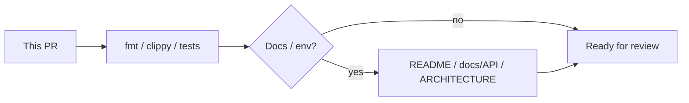

## Summary

<!-- What does this PR change and why? -->

## Checklist

- [ ] `cargo fmt --all -- --check`
- [ ] `cargo clippy --workspace --all-targets -- -D warnings`
- [ ] `cargo test --workspace` (and integration test if DB-related)
- [ ] Docs updated if behavior or env vars changed (`README.md`, `docs/API.md`)

## Notes

<!-- Risks, follow-ups, screenshots for UI -->
