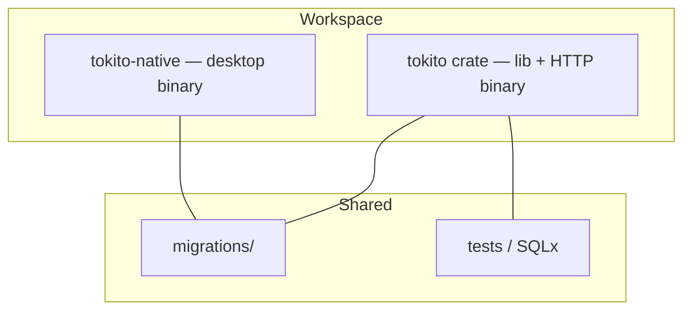
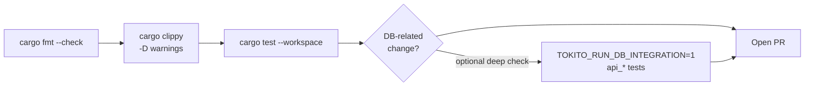

# Contributing to Tokito

Thanks for improving Tokito. This workspace ships:

- **`tokito`** — library + **`cargo run -p tokito`** HTTP API  
- **`tokito-native`** — **`cargo run -p tokito-native`** desktop (egui)

Both share migrations, domain logic, and integrations.



---

## Before you open a PR



From the repo root:

```bash
cargo fmt --all -- --check
cargo clippy --workspace --all-targets -- -D warnings
cargo test --workspace
```

API integration tests (embedded Postgres; set **`TOKITO_RUN_DB_INTEGRATION=1`**, first run may download binaries). CI sets this automatically.

```bash
TOKITO_RUN_DB_INTEGRATION=1 cargo test -p tokito --test api_designs --test api_parts --test api_schematic
```

---

## Guidelines

- **Small, focused commits** with messages that explain *why*, not only *what*.
- **Match existing style** — modules, naming, error handling (`AppError`), SQLx patterns.
- **Update docs** when behavior or env vars change — especially **`README.md`** and **`docs/API.md`**.
- **Never commit secrets** — use **`.env.example`** for new configuration knobs only.

---

## Security

Do **not** file undisclosed vulnerabilities as public GitHub issues. Follow **[SECURITY.md](SECURITY.md)**.

---

## Licensing

By submitting a contribution, you agree it may be distributed under the project’s terms: **MIT**. See [`LICENSE-MIT`](LICENSE-MIT).
