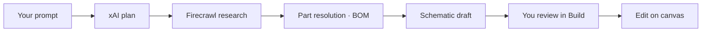
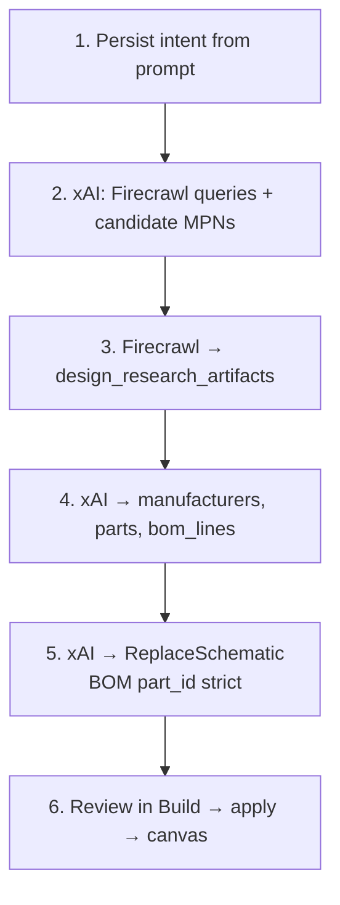
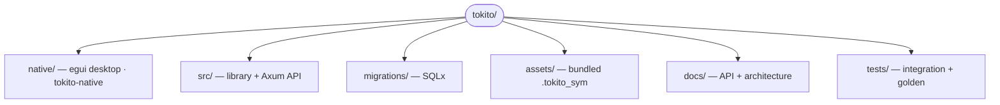

# Tokito

**You describe the board. AI builds it. You edit the result.**

Desktop schematic studio and HTTP API: AI researches parts, drafts BOM and schematic, then you refine on the canvas.

## Features

- **AI build** — describe the design goal; xAI plans → Firecrawl research → part resolution → grounded schematic and BOM (review before apply)
- **Schematic editor** — native egui canvas: place symbols, wire, labels, ERC, undo/redo, multi-sheet document model
- **Catalog** — manufacturers, parts, BOM lines in PostgreSQL
- **Exports** — JSON design bundle, BOM CSV, connectivity netlist, S-expression netlist, SVG, PDF, MCAD handoff
- **Distributor search** — LCSC and optional Nexar for package/footprint hints (`GET /v1/catalog/search`)

### How AI build fits together



## Windows app (no command line)

**Requirements to build:** Rust 1.88+, [Visual Studio Build Tools](https://visualstudio.microsoft.com/visual-cpp-build-tools/) (C++ workload).

```powershell
.\scripts\package-windows.ps1
```

Open `dist\Tokito\Tokito.exe`. Keep the `assets` folder next to the executable.

Data lives in **embedded PostgreSQL** (pg-embed, no Docker or cloud DB). Files are under `%LOCALAPPDATA%\tokito\postgres\`. The first run may download database binaries once (network required).

**Before you build a board:** copy `dist\Tokito\.env.example` to `.env` beside the exe and set `TOKITO_XAI_API_KEY` and `TOKITO_FIRECRAWL_API_KEY`.

## Developer quick start

```bash
cp .env.example .env
# Set TOKITO_XAI_API_KEY and TOKITO_FIRECRAWL_API_KEY — required for Build
cargo run -p tokito-native
```

Bundled symbols live under [`assets/base-symbols/`](assets/base-symbols/) (CC-BY-SA 4.0). Regenerate with:

```bash
cargo run -p tokito-native --bin generate-base-symbols
```

### HTTP API

```bash
cargo run -p tokito
curl -s http://localhost:8080/health
```

Default bind: `TOKITO_HTTP_ADDR` (`0.0.0.0:8080`). Optional static SPA: `TOKITO_STATIC_DIR=/path/to/dist`.

### Studio shortcuts

| Action | Key |
|--------|-----|
| Select | Q |
| Wire | W |
| Pan | H |
| Grid | G (toolbar) |
| Snap | S (toolbar) |
| Zoom fit | Home |
| Undo / Redo | Ctrl+Z / Ctrl+Y |
| Build schematic | Ctrl/⌘+Enter |
| Command palette | Ctrl+Shift+P |

## Configuration

| Variable | Required | Purpose |
|----------|----------|---------|
| `TOKITO_XAI_API_KEY` | **yes** (Build) | xAI — plan, part resolution, schematic draft |
| `TOKITO_FIRECRAWL_API_KEY` | **yes** (Build) | Web search / datasheet research |
| `TOKITO_EMBEDDED_PORT` | no | Embedded Postgres TCP port (default `15432`) |
| `TOKITO_JWT_SECRET` | release | JWT signing for `/v1` (dev default only in debug builds) |
| `TOKITO_NEXAR_CLIENT_ID` / `SECRET` | no | Nexar package data in catalog search |
| `TOKITO_LCSC_ANONYMOUS_SEARCH` | no | LCSC catalog search (default on) |
| `TOKITO_CORS_ORIGINS` | no | Comma-separated origins; empty = permissive dev |

See [`.env.example`](.env.example) for the full list.

## AI build pipeline

Same stages as **[`POST /v1/designs/:id/schematic/suggest`](docs/API.md#post-v1designsidschematicsuggest)** in the API.



Deep dive: [`docs/API.md`](docs/API.md), [`docs/ARCHITECTURE.md`](docs/ARCHITECTURE.md).

## Repository layout



## Testing

```bash
cargo fmt --all -- --check
cargo clippy --workspace --all-targets -- -D warnings
cargo test --workspace
```

API integration tests start embedded PostgreSQL (pg-embed may download binaries on first run). They run in CI automatically; locally opt in with:

```bash
# Linux/macOS
TOKITO_RUN_DB_INTEGRATION=1 cargo test -p tokito --test api_designs --test api_parts --test api_schematic

# PowerShell
$env:TOKITO_RUN_DB_INTEGRATION = '1'
cargo test -p tokito --test api_designs --test api_parts --test api_schematic
```

Default `cargo test --workspace` still runs all tests that do not need DB extraction (unit tests, golden exports).

## License

MIT — see [`LICENSE`](LICENSE).
