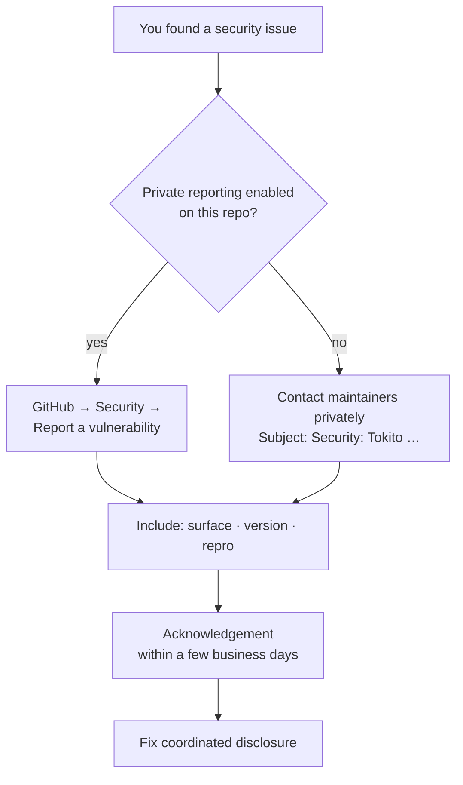

# Security policy

## Supported releases

Security fixes land on the **default branch** (`main` / `master`). Tokito **0.1.x** does not have separate long-term support branches yet.

---

## Reporting a vulnerability

**Please do not** open a **public** issue for an undisclosed security bug.

1. Use GitHub **private vulnerability reporting** if it is enabled for this repository (**Security → Report a vulnerability**).
2. Otherwise, contact the maintainers privately with a subject line such as `Security: Tokito <short summary>`.

Include:

- **Affected area** — desktop app, optional network listener, auth, integrations, etc.
- **Version or commit** you tested.
- **Steps to reproduce** or a minimal proof of concept, if it can be shared safely.

We aim to acknowledge valid reports within a **few business days** and coordinate disclosure after a fix is available.

---

## Scope & expectations

- Tokito stores **design and catalog data** locally and may call **third-party services** (xAI, Firecrawl, distributors). Protect **`TOKITO_JWT_SECRET`**, your database files, and API keys; restrict access to the machine hosting the data directory.
- **Release-quality builds** should set a strong `TOKITO_JWT_SECRET`; debug builds may use a development default that must not be deployed.
- **Supply chain**: run **`cargo audit`** or enable **Dependabot** in your fork/org as part of your own review process.

Thank you for helping keep users safe.
