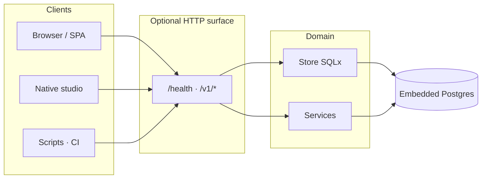
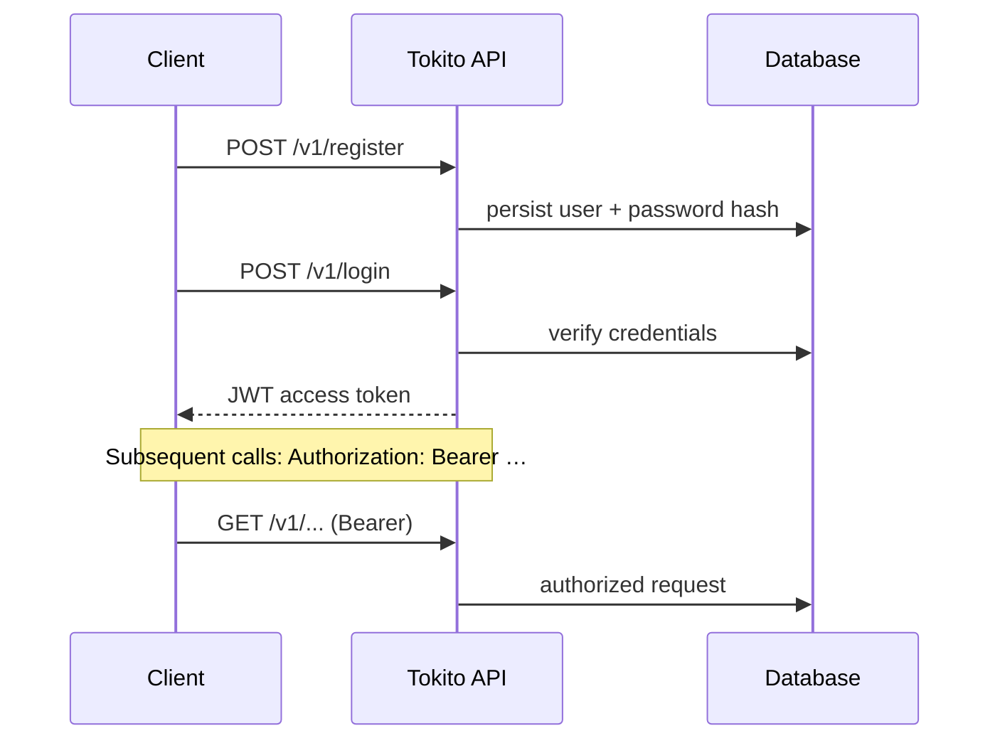
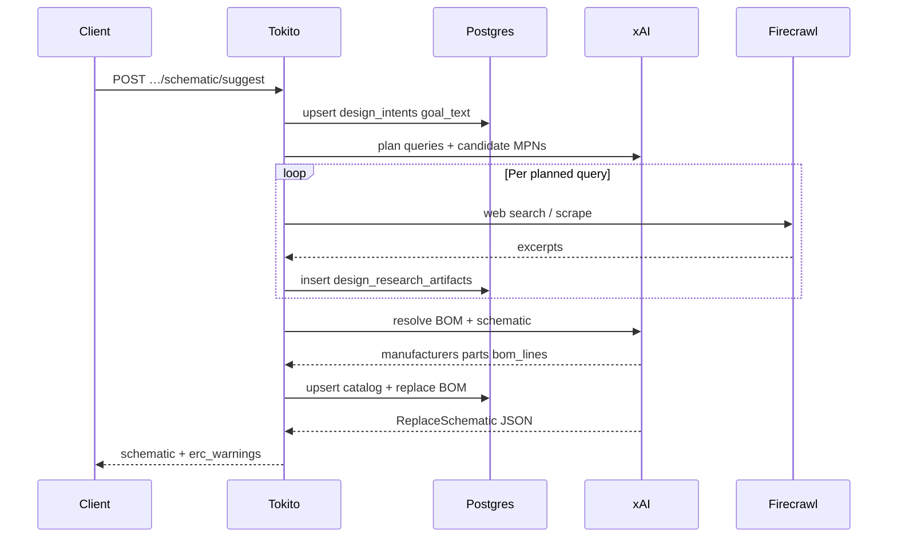
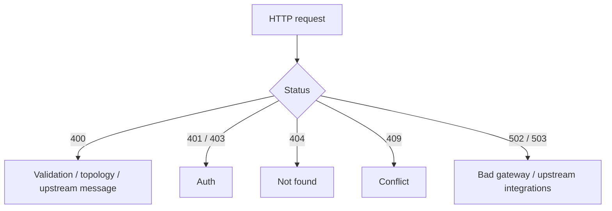

# HTTP route map (maintainers)

> **Tokito is desktop software.** End users run **Tokito.exe** (or the native binary); they do not call HTTP endpoints. This document describes the **optional Axum surface** in the shared `tokito` crate, used for **automated tests**, tooling, and non-default deployments.

Tokito can expose a **versioned JSON** surface under **`/v1`**, plus **`GET /health`**. Request bodies are **`application/json`** unless stated otherwise.

**Typical base URL (when the optional server is run):** `http://localhost:8080`



---

## Authentication

Protected routes require a **Bearer JWT** obtained via **`POST /v1/login`** (after **`POST /v1/register`**). Send:



```http
Authorization: Bearer <token>
```

Integration keys and auth flows are implemented in `src/handlers/` under auth routes; the **native desktop** path uses a simplified local user for development convenience.

---

## Health

### `GET /health`

Liveness probe. **No auth.**

**200** body:

```json
{ "status": "ok", "service": "tokito" }
```

---

## Manufacturers

### `POST /v1/manufacturers`

Create a manufacturer.

```json
{ "name": "STMicroelectronics", "slug": null }
```

`slug` is optional; when omitted it is derived from `name`.

### `GET /v1/manufacturers?limit=100`

List manufacturers (newest / ordering as implemented in store).

---

## Parts

### `POST /v1/parts`

```json
{
  "manufacturer_id": "<uuid>",
  "mpn": "STM32F103C8T6",
  "description": "MCU",
  "package_name": "LQFP48",
  "attributes": { "voltage_v": 3.3 }
}
```

### `GET /v1/parts?q=stm&limit=50`

Search by MPN/description fragment. If `q` is empty, returns up to `limit` parts ordered by MPN.

### `GET /v1/parts/:id`

Fetch a single part by UUID.

---

## Designs

### `POST /v1/designs`

```json
{ "name": "Sensor board", "description": "Rev A" }
```

### `GET /v1/designs/:id` · `PATCH /v1/designs/:id`

Metadata read/update.

```json
{ "name": "Sensor board rev B", "description": null }
```

### `GET /v1/designs/:id/export`

| Query | Result |
|-------|--------|
| `?format=json` (default) | Snapshot: `design`, `bom`, `schematic`, `intent`, `research_artifacts` |
| `?format=csv` | BOM CSV download |
| `?format=netlist` | Plain-text connectivity (`NET  REFDES.PIN` style) |

---

## BOM

### `GET /v1/designs/:id/bom`

### `PUT /v1/designs/:id/bom`

Full replace of BOM lines.

```json
{
  "lines": [
    { "part_id": "<uuid>", "quantity": 2, "sort_order": 0, "notes": "bulk cap" },
    { "part_id": "<uuid>", "quantity": 1, "sort_order": 1, "notes": null }
  ]
}
```

Rules: `quantity` > 0; every `part_id` must exist in **`parts`**.

---

## Schematic graph

### `GET /v1/designs/:id/schematic`

Returns stored instances, nets, and pins (UUID-backed).

### `PUT /v1/designs/:id/schematic`

Transactional replace. Payload shape:

```json
{
  "instances": [
    {
      "part_id": "<uuid optional>",
      "ref_des": "U1",
      "position": { "x": 0, "y": 0 },
      "rotation": 0,
      "meta": {}
    }
  ],
  "nets": [{ "name": "GND" }, { "name": "VCC" }],
  "pins": [
    { "instance_ref": "U1", "pin_name": "VDD", "net_name": "VCC" },
    { "instance_ref": "U1", "pin_name": "GND", "net_name": "GND" }
  ]
}
```

Validation rules:

- Every `instance_ref` in `pins` must match an `instances[].ref_des`.
- Every `net_name` in `pins` must appear in `nets`.
- `ref_des` values must be unique in the payload.

**200** body:

```json
{ "ok": true, "erc_warnings": [] }
```

`erc_warnings` are **non-blocking** advisories. Invalid topology returns **400**.

---

### `GET /v1/designs/:id/schematic/document`

Returns the editor-grade schematic document used by the production canvas. This includes sheet metadata, placed symbols with pin geometry, wire segments, junctions, labels, power symbols, no-connect markers, text, buses, and ERC markers.

If a document has not been saved yet, the server derives one from the normalized schematic graph so older designs still open in the new editor.

### `PUT /v1/designs/:id/schematic/document`

Persists the editor document and derives the normalized schematic graph used by existing API/export paths. This is the preferred endpoint for schematic editor clients.

Minimal shape:

```json
{
  "schema_version": 1,
  "sheets": [{ "id": "root", "name": "Root", "path": "/", "page_size": { "width": 1160, "height": 820 }, "grid": 40, "title_block": {} }],
  "symbols": [],
  "wire_segments": [],
  "junctions": [],
  "net_labels": [],
  "power_symbols": [],
  "no_connects": [],
  "text_items": [],
  "buses": [],
  "erc_markers": []
}
```

**200** body:

```json
{
  "ok": true,
  "document_diagnostics": [],
  "erc_warnings": []
}
```

`document_diagnostics` report geometry-to-netlist issues such as conflicting labels on the same connected node. Invalid derived topology returns **400**.

---

### `POST /v1/designs/:id/schematic/suggest`

**AI build entrypoint** (same orchestration as **Build schematic** in the native app).

**Body:**

```json
{ "prompt": "12 V to 5 V buck, 2 A, …" }
```

**Orchestration** (mirrors the **Build** tab in the native app):



**Stages (server-side):**

1. Upsert **intent** with `goal_text` = prompt.
2. **xAI**: planned Firecrawl queries + candidate parts.
3. **Firecrawl**: web search per query → **`design_research_artifacts`** (`kind = firecrawl_search`).
4. **xAI**: resolve manufacturers/parts/qty from excerpts + candidates.
5. **Postgres**: upsert catalog rows; **replace BOM** with validated `part_id`s.
6. **xAI**: emit **`ReplaceSchematic`** with **BOM-grounded `part_id`s** (strict mode when BOM non-empty).

**Environment:** `TOKITO_XAI_API_KEY` and `TOKITO_FIRECRAWL_API_KEY` must be set on the server. Failures (no ingestible pages, unresolved parts) surface as **400** with a message.

**200** body:

```json
{
  "schematic": { "instances": [], "nets": [], "pins": [] },
  "erc_warnings": []
}
```

---

### `POST /v1/designs/:id/schematic/validate`

Same JSON as **`PUT …/schematic`**; **nothing persisted**. Use for editor previews.

```json
{
  "topology_ok": true,
  "topology_error": null,
  "erc_warnings": []
}
```

---

## Intent & research

### `GET /v1/designs/:id/intent` · `PUT /v1/designs/:id/intent`

```json
{ "goal_text": "5 V buck from 12 V …", "constraints": { "iout_a": 2 } }
```

`constraints` must be a JSON **object** at the root.

### `GET /v1/designs/:id/research`

Lists **`design_research_artifacts`** newest-first.

**Artifact `kind` values** (database check): `firecrawl_scrape`, `firecrawl_search`, `manual_note`.

### `POST /v1/designs/:id/research/scrape`

Body:

```json
{ "urls": ["https://example.com/datasheet"] }
```

Firecrawl **scrape** per URL; quota enforced per URL.

### `POST /v1/designs/:id/research/search`

Body:

```json
{ "query": "LM2596 5V buck datasheet", "limit": 5 }
```

Firecrawl [**Search**](https://docs.firecrawl.dev/features/search); markdown per hit. Response shape includes **`artifact_ids`** and **`count`**.

---

## Integration proxies (authenticated)

Low-level passthroughs for tooling (same scrape quota semantics):

| Method | Path |
|--------|------|
| `POST` | `/v1/integrations/firecrawl/scrape` |
| `POST` | `/v1/integrations/firecrawl/search` |

---

## Errors

Typical error JSON:

```json
{ "error": "human-readable message" }
```



Typical status codes: **400** (validation), **404**, **409** (conflict), **401/403** (auth), **502/503** (upstream integrations).
