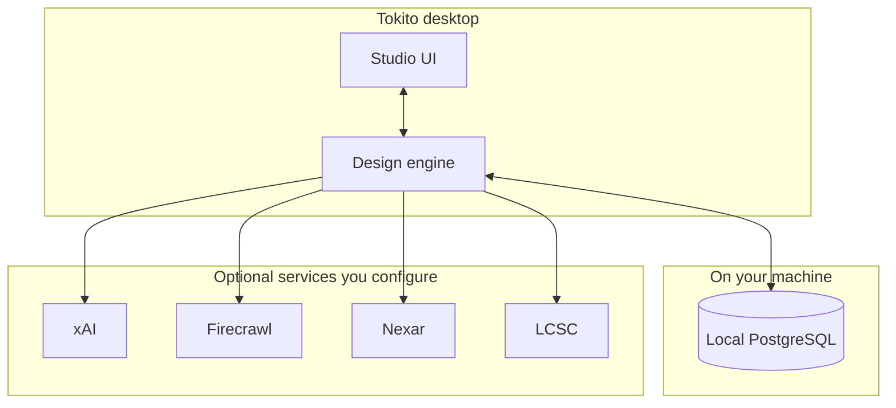
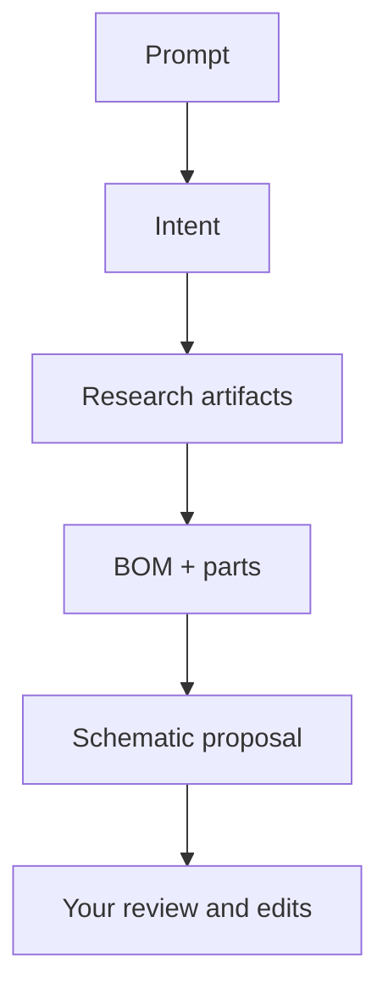

# How Tokito works

Tokito is **desktop software**: one window, local data, optional cloud **AI and research services** you configure with API keys.

## What runs on your computer

The **Tokito** application bundles:

- **Studio UI** — egui: schematic canvas, docked panels (Build, BOM, 3D preview, research, messages, console).
- **Design engine** — Shared Rust core: schematic model, validation (ERC), exports, AI pipeline orchestration, SQL data access.
- **Local database** — PostgreSQL binaries managed in-process (pg-embed). Your designs, parts, BOM, and research artifacts are stored here. Data directory is under the OS app-data path (e.g. `%LOCALAPPDATA%\tokito\` on Windows).

There are no extra servers for you to install or containers to run for normal use.

## AI build flow (simplified)

1. Your prompt becomes structured **intent** stored with the design.
2. **xAI** proposes research queries and candidate parts; **Firecrawl** pulls web/datasheet context into **research artifacts**.
3. **xAI** resolves manufacturers, parts, and BOM lines grounded in that research.
4. **xAI** emits a schematic update; you **review** in the Build panel before applying to the canvas.

## Data model (overview)

- **Identity** — local user for single-seat workflows.
- **Catalog** — manufacturers, parts, offers.
- **Designs** — metadata, intent, research, schematic tables, JSON document for the editor, BOM lines.

## Native studio modules (high level)

| Area | Role |
|------|------|
| `native/src/editor/` | Canvas, tools, connectivity sync, ERC markers, undo |
| `native/src/app/studio/` | Dock, panels, inspector, Build, command palette |
| `native/src/mcad_viewer/` | 3D board preview |
| `native/src/base_symbols/` | Symbol libraries (`.tokito_sym`, imported `.kicad_sym`) |
| `src/connectivity/` | Shared net graph (union-find, net ids, labels) |

Editor behavior and exports: [SCHEMATIC_EDITOR.md](SCHEMATIC_EDITOR.md).

## Repository layout

The workspace shares one **Rust library** (`tokito`) used by the desktop binary (`tokito-native`) for persistence, services, and migrations. Keeping logic in the library avoids duplicating business rules between UI and tests.

---

## Maintainer note: HTTP surface

The same `tokito` library can drive an optional **in-process HTTP stack** used for automated tests and advanced setups. It is **not** the primary way you use the product day to day. Route-level detail for that layer lives in [`API.md`](API.md).
