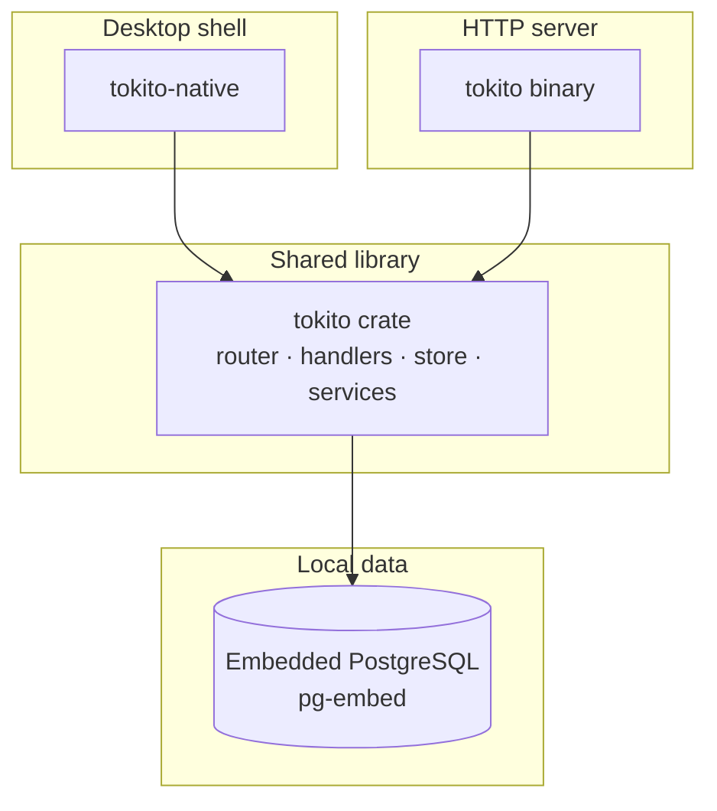
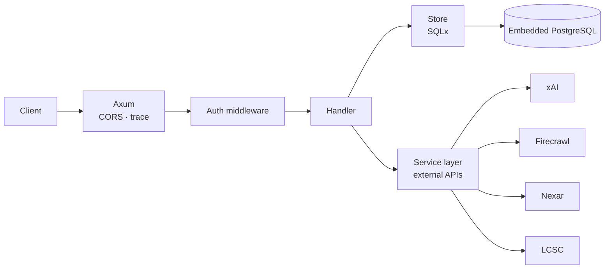
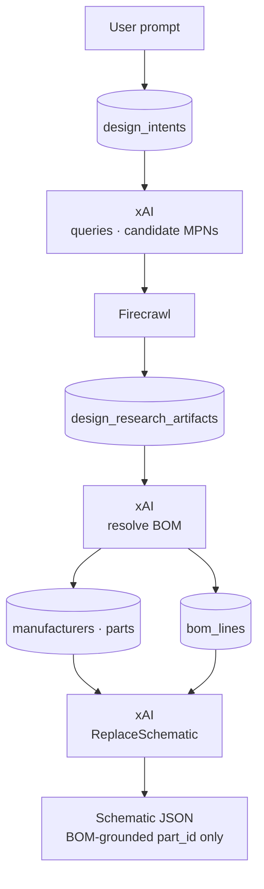
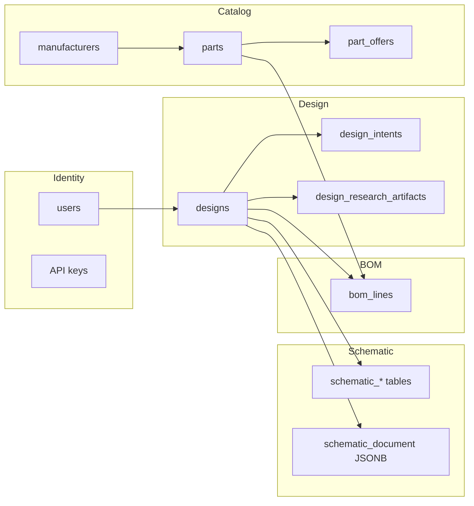
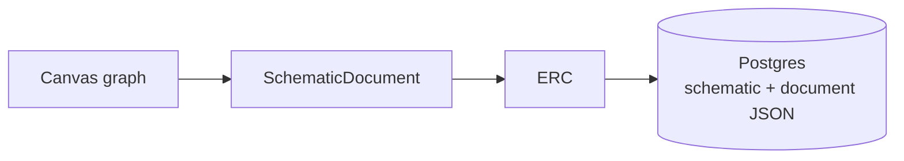

# Architecture

Tokito is a Rust library and Axum server with an optional egui native shell. **Embedded PostgreSQL** (pg-embed) is the system of record — no external or cloud database.

## Runtime surfaces

| Surface | Binary | Role |
|---------|--------|------|
| Desktop | `tokito-native` | egui studio; links `tokito` for HTTP-backed features |
| API | `tokito` | `/v1`, `/health`, optional static files (`TOKITO_STATIC_DIR`) |

Both binaries run SQLx migrations from `migrations/` at startup.

## HTTP request path

| Layer | Path | Responsibility |
|-------|------|----------------|
| Router | `src/router.rs` | Routes, `AppState` |
| Handlers | `src/handlers/` | HTTP adapters, `AppError` mapping |
| Store | `src/store/` | Queries and transactions |
| Services | `src/services/` | AI build, validation, exports, catalog |

Key services: `design_pipeline`, `schematic_gen`, `schematic_validate`, `erc_fixes`, `sexp_netlist`, `svg_export`, `pdf_export`, `catalog_search`, `lcsc`, `nexar`.

## AI build data flow

## Data model

| Area | Tables |
|------|--------|
| Identity | users, API keys, usage |
| Catalog | manufacturers, parts, part_offers |
| Design | designs, design_intents, design_research_artifacts |
| Schematic | schematic_instances, schematic_nets, schematic_pins; `schematic_document` JSONB |
| BOM | bom_lines |

Domain relationships (simplified):

## Native editor

| Module | Role |
|--------|------|
| `native/src/editor/` | Canvas, tools, hit-test, render, undo |
| `native/src/app/studio/` | Dock UI, place panel, inspector, Build tab |
| `native/src/base_symbols/` | Load `.tokito_sym` from `assets/base-symbols/` + user dir |
| `native/src/symbol_format/` | Tokito symbol S-expression parser |

Native save path:

## Operations

- **Database:** pg-embed under the user data dir (`TOKITO_EMBEDDED_PORT`, default `15432`). Hold the `EmbeddedPostgres` handle for the process lifetime.
- **Pool size:** `TOKITO_DB_MAX_CONNECTIONS` (default 10).
- **Migrations:** applied at process start.
- **Secrets:** set `TOKITO_JWT_SECRET` in release builds; never commit `.env`.

## Related

- [API.md](API.md) — route reference
