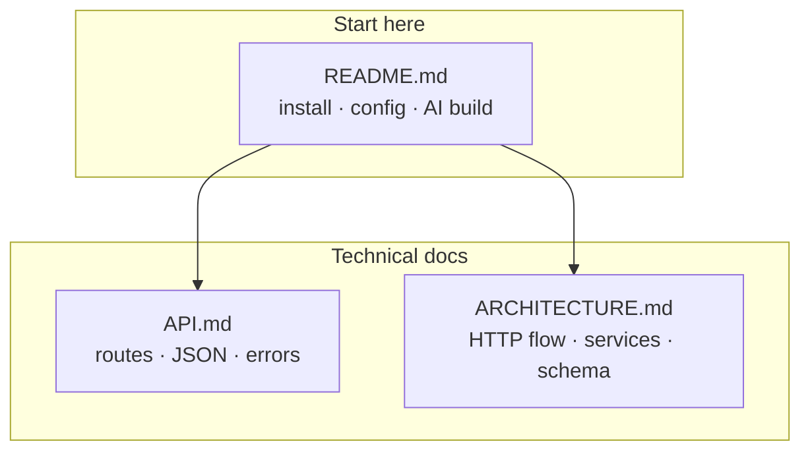

# Documentation

Technical reference for Tokito. Setup and environment variables are in the [repository README](../README.md).

| Document | Audience | Contents |
|----------|----------|----------|
| [API.md](API.md) | Integrators | `/v1` routes, JSON shapes, errors |
| [ARCHITECTURE.md](ARCHITECTURE.md) | Contributors | HTTP flow, services, Postgres schema |

## Conventions

- Examples use `http://localhost:8080` unless noted.
- `/v1` routes require a JWT except where documented.
- The native app uses a bootstrap local user for single-seat workflows.

Update API.md and the root README when routes or env vars change.
